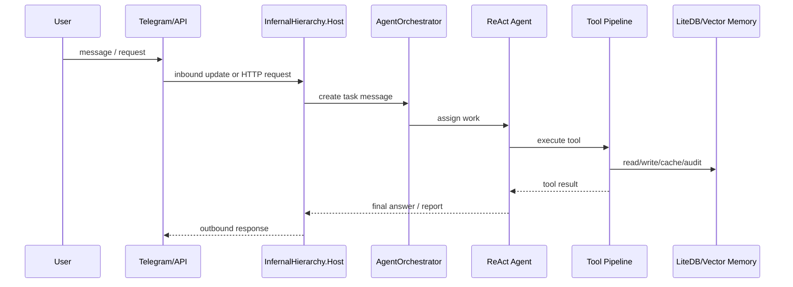

# End-to-End Request Tracing

This runbook explains how to trace a request through the system from operator input to tool execution and final response.

## Scope

Typical flow:



## Where to look first

### 1. Logs

Start with structured logs for:

- inbound Telegram or HTTP request,
- agent creation or selection,
- ReAct thought/action transitions,
- tool execution result,
- authorization denial,
- memory write/read outcome,
- final outbound response.

Useful subsystems:

- `InfernalHierarchy.Telegram`
- `InfernalHierarchy.Host`
- `InfernalHierarchy.Agents`
- `InfernalHierarchy.Tools`
- `InfernalHierarchy.Memory`

### 2. Traces

If OTLP or console tracing is enabled, follow the request path across:

- HTTP endpoints,
- tool execution spans,
- downstream HTTP calls,
- long-running service operations.

### 3. Metrics and health

Check:

- `/health/ready`
- metrics endpoint
- trace/request profiling endpoints when enabled

## Common correlation handles

- agent id
- tool name
- task id
- message id
- query/command ids for CQRS paths
- custom tool id / source hash for dynamic tools

## Failure triage by stage

### Input never reaches an agent

Check:

1. Telegram token / allowed user ids
2. HTTP endpoint enabled and reachable
3. message bus subscription and routing

### Agent loops or does nothing useful

Check:

1. persona tool list
2. forced invocation usage when deterministic execution is needed
3. repeated parse failures in ReAct loop
4. duplicate suppression behavior for side-effect tools

### Tool is denied or not found

Check:

1. [Tool Authorization Debugging](Tool-Authorization-Debugging.md)
2. effective tool registry contents
3. exact tool name casing/normalization

### Tool runs but result is missing or stale

Check:

1. tool cache hit/store metadata
2. rate limiting outcome
3. memory store write path
4. side-effect terminal-tool stop behavior

### Memory is missing expected data

Check:

1. LiteDB health
2. visibility/sharing rules for facts
3. pruning/backup services
4. vector-memory enablement and health if semantic lookup is expected

## Deterministic debugging trick

When the LLM path makes debugging noisy, use forced invocation through `/api/chat`:

```text
Invoke tool <name> {json}
```

That lets you isolate tool pipeline behavior from agent reasoning behavior.

## Related docs

- [Solution Architecture](../Solution-Architecture.md)
- [Custom Tools Runbook](Custom-Tools.md)
- [Tool Authorization Debugging](Tool-Authorization-Debugging.md)
- [OBSERVABILITY](../../OBSERVABILITY.md)