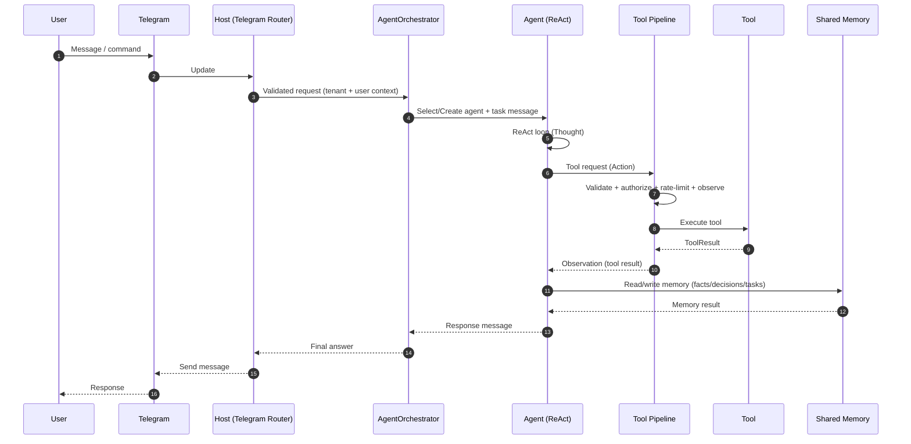

# Solution Architecture

This solution implements a local-first autonomous agent system (“InfernalHierarchy”) with a hierarchical orchestration model, pluggable tools, shared memory, and a Telegram interface.

## Goals and non-goals

### Goals

- Run locally (offline-first) with a local LLM endpoint (Ollama OpenAI-compatible API).
- Support a hierarchy of agents (Supreme → Prince → Duke → Worker) with delegation.
- Provide durable shared memory for facts/decisions/tasks with pruning.
- Provide a tool system with authorization, rate limiting, and observability.
- Operate as a long-running service with strong diagnostics (logs, traces, metrics, health checks).

### Non-goals

- Cloud-first architecture (by design, most dependencies are local/embedded).
- Heavy UI (Telegram is the primary interface).

## High-level architecture

## Architecture diagrams

### Container / context (high-level)

```mermaid
flowchart LR
	user[Human Operator] --> tg[Telegram]
	tg --> host[InfernalHierarchy Host (.NET Worker)]

	host --> ollama[Ollama (OpenAI-compatible API)]
	host --> litedb[(LiteDB Shared Memory)]
	host --> vec[(Vector Memory - optional)]
	host --> searx[SearXNG/Brave Search - optional]

	subgraph Local Machine
		host
		ollama
		litedb
		vec
		searx
	end
```

### Component view (internal)

```mermaid
flowchart TB
	subgraph Host[InfernalHierarchy.Host]
		di[DI Composition Root]
		cfg[Config + Secrets + Validation]
		obs[Logging + Tracing + Metrics + Health]
		svc[Background Services]
		sup[AgentSupervisor]
		tgsvc[Telegram Bot Service]
	end

	subgraph Agents[InfernalHierarchy.Agents]
		orch[AgentOrchestrator]
		factory[IAgentFactory]
		react[ReAct Agent]
	end

	subgraph Tools[InfernalHierarchy.Tools]
		registry[Tool Registry]
		pipeline[IToolExecutionPipeline]
		authz[IToolAuthorizationService]
		rl[IToolRateLimiter]
	end

	subgraph Memory[InfernalHierarchy.Memory]
		sm[ISharedMemory]
		prune[Memory Pruning]
		embed[Embeddings/ONNX (optional)]
		vm[IVectorMemory (optional)]
	end

	subgraph Messaging[InfernalHierarchy.Messaging]
		bus[IMessageBus]
	end

	subgraph Personas[InfernalHierarchy.Personas]
		loader[IPersonaLoader]
		souls[souls/*.json]
		templates[templates/*.json]
	end

	tgsvc --> orch
	sup --> bus
	sup --> factory
	sup --> sm
	orch --> factory
	factory --> loader
	loader --> souls
	loader --> templates

	orch --> react
	react --> pipeline
	pipeline --> registry
	pipeline --> authz
	pipeline --> rl
	pipeline --> sm
	sm --> prune
	sm --> vm
	vm --> embed

	react <--> bus
	obs --- tgsvc
	obs --- pipeline
	cfg --- di
```

### Host process

The entry point is a Worker/Hosted-Service style host that:

- boots configuration (including secrets and tool-permission policy),
- wires dependency injection,
- starts background services (health, metrics, pruning, monitoring),
- runs the Telegram update loop and routes inbound messages.

It also optionally runs **agent supervision** via `AgentSupervisor` (when enabled):

- Observes active agents and infers progress from status changes and recent decision writes.
- When a subtree appears stalled/looping, publishes a command to the root agent: `SUPERVISOR_REPLAN: ...`.
- Uses a **root-scoped cooldown** (based on `AgentSupervisor:InterventionCooldown`) to avoid thrashing across a whole tree.
- Escalates from **replan → preempt** only if there has been **no progress since the last supervisor replan**, and a small grace window has elapsed (derived from `PollInterval`).
- Never auto-preempts the root/Supreme agent.

### Agent layer

Agents are created via an `IAgentFactory` and tracked in an `IAgentRegistry`.

Common patterns:

- **ReAct loop**: an agent iterates through *Thought → Action → Observation* steps.
- **Delegation**: higher-rank agents can create and task lower-rank agents.
- **Templates/personas**: an agent’s behavior is driven by a persona (a “soul”) and task templates.

Personas are stored as JSON under `souls/` and loaded through an `IPersonaLoader`.

### Tools layer

Tools are the “capability surface” of the system. Tools are:

- registered/discovered via a registry,
- executed through an execution pipeline,
- authorized by `IToolAuthorizationService`,
- throttled by `IToolRateLimiter`,
- instrumented for tracing/metrics/logging.

Examples: memory read/write, web search, Telegram send, sub-agent creation.

### Memory layer

Shared memory provides durable context across agent runs.

- Primary: embedded persistence (LiteDB) via `ISharedMemory`.
- Optional: vector memory via `IVectorMemory` to support semantic retrieval (when configured).
- Background pruning/retention enforcement to prevent unbounded growth.

Memory entries typically include tenant context, tags, timestamps, and content.

### Messaging layer

The internal messaging fabric is Channel-based (`System.Threading.Channels`) behind `IMessageBus`.

Key aims:

- decouple producers/consumers,
- enable backpressure,
- keep the host responsive under load.

### Telegram interface

The Telegram project hosts the bot interface and command routing.

- Incoming updates are validated and mapped into agent actions.
- Outbound responses are sent via a Telegram client abstraction.

## Cross-cutting concerns

### Configuration

- Defaults in `appsettings.json`
- Environment-specific overrides (Development/Production)
- Secrets via local secrets files / user secrets (see `secrets/` and `appsettings.secrets.json.example`)

### Security

- Tool authorization and per-tool policy
- Operator-level API key for privileged operations (where enabled)
- Secret rotation background service

See: [SECURITY_CONFIG](../SECURITY_CONFIG.md)

### Observability

- Structured logging (Serilog) with enrichers
- Tracing (OpenTelemetry) with spans across tool execution and agent loops
- Metrics (Prometheus endpoint) + health checks

See: [OBSERVABILITY](../OBSERVABILITY.md)

## Code map (projects)

- `InfernalHierarchy.Core`: contracts (interfaces), entities, shared infrastructure primitives
- `InfernalHierarchy.Host`: composition root, background services, security/observability wiring
- `InfernalHierarchy.Agents`: agent implementations (Base/ReAct), orchestration and templating
- `InfernalHierarchy.Tools`: tools, execution pipeline, clients (LLM/web search)
- `InfernalHierarchy.Memory`: LiteDB implementation + pruning + embeddings/ONNX where applicable
- `InfernalHierarchy.Messaging`: Channel-based bus and messaging abstractions
- `InfernalHierarchy.Personas`: persona/soul loading and template composition
- `InfernalHierarchy.Telegram`: bot client, update routing, command handlers

## Runtime sequence (typical)

1. Telegram update received
2. Input validated, tenant/user context resolved
3. Orchestrator selects or creates an agent instance (persona)
4. Agent runs a ReAct loop
5. Tool calls are authorized, executed, observed, and recorded
6. Memory is updated (facts/decisions/tasks)
7. Response sent back via Telegram

### Runtime sequence (detailed)


